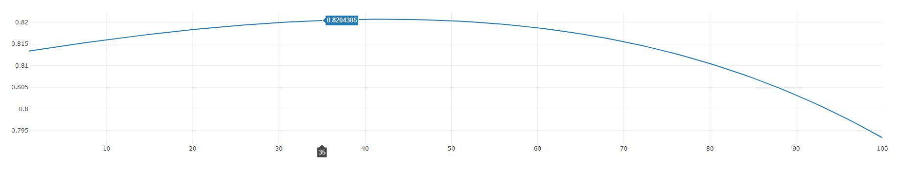

Raluca Gomoescu, Adrian Stoianovici, Maria Popescu
1241F

An implementation after Paul A. Gagniuc et al. Spectral Forecast: A general purpose prediction model as an alternative to classical neural networks.  Chaos 30, 033119 (2020); doi: 10.1063/1.5120818 
https://aip.scitation.org/doi/pdf/10.1063/1.5120818

This is an implementation of spectral forecast made in javascript. It uses nodeplotlib to outputs the results.
This project build an prediction matrix for 100 steps from two matrices. The prediction matrix is afterwards compared to a sample matrix from a patient and outputs in a plot the similarities index.

To run this project, you must have installed NodeJS then run the command: node main.js.

